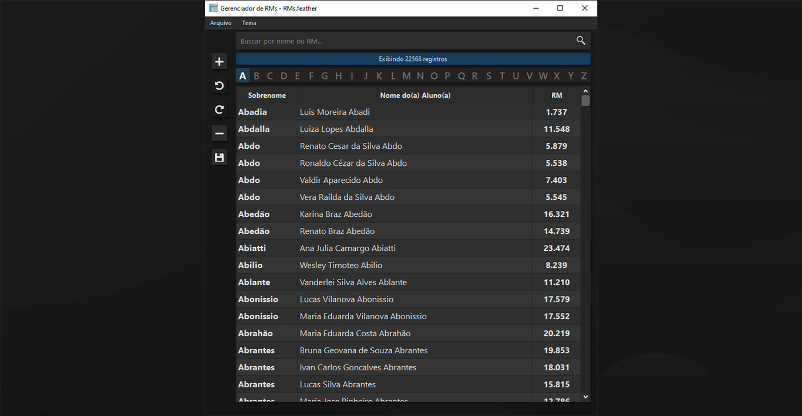

# Gerenciador de RMs

Um aplicativo desktop para facilitar a organização, busca e manutenção de Registros de Matrícula (RM) de alunos. Voltado para secretarias e equipes acadêmicas que precisam trabalhar com listas de alunos em planilhas Excel de forma prática, rápida e segura.

---

## Funcionalidades principais

- Interface gráfica moderna construída com PyQt5.
- Carregamento e salvamento de planilhas Feather e Excel (.xlsx) via pandas / openpyxl.
- Busca rápida por RM (numérico) ou por nome (insensível a acentos).
- Validação de RMs (numéricos), detecção de RMs duplicados e aviso de nomes similares.
- Adição em lote de alunos com validações e feedback visual.
- Undo / redo para operações de edição (Command Pattern).
- Suporte a temas (claro / escuro) via CSS e ajustes para High-DPI.

---

## Requisitos

- Python 3.8 ou superior (3.9–3.11 recomendado)
- Plataforma: Windows / macOS / Linux (PyQt5 é multiplataforma)
- Memória: dependendo do tamanho das planilhas; para arquivos muito grandes use máquinas com mais RAM

Dependências principais:
- PyQt5
- pandas
- openpyxl

---

## Instalação rápida

1. Clone o repositório:
   git clone https://github.com/luis0henrique/Gerenciador-de-RM.git
   cd Gerenciador-de-RM

2. Crie e ative um ambiente virtual (recomendado):
   python -m venv .venv
   # Windows
   .\.venv\Scripts\activate
   # macOS / Linux
   source .venv/bin/activate

3. Instale dependências

---

## Execução

Inicie a aplicação a partir do script principal:
python main.py

Argumentos opcionais:
--debug    Ativa logging em nível DEBUG (útil para desenvolvimento e diagnóstico)

---

## Como usar (fluxo básico)

1. Abra o aplicativo.
2. Carregue uma planilha Excel com, pelo menos, as colunas:
   - Sobrenome
   - Nome do(a) Aluno(a)
   - RM

   O programa padroniza a ordem das colunas quando necessário.

3. Pesquise:
   - Por RM: digite apenas números.
   - Por nome: digite texto (busca insensível a acentos e case-insensitive).

4. Para adicionar alunos em lote, abra a janela "Adicionar Alunos(as) em Lote" e siga as instruções; o sistema validará RMs e mostrará avisos de duplicatas e similaridade de nomes.

5. Salve alterações para gravar em Excel (será atualizado o arquivo especificado).

---

## Estrutura do repositório (resumida)

- main.py — ponto de entrada
- models/ — lógica de negócio (ExcelManager, DataManager, SearchManager, CommandManager)
- views/ — telas e componentes PyQt5
- utils/ — helpers, estilos e utilitários (CSS em utils/themes)
- assets/ — imagens (ícone, splash, etc.)
- resources/, etc.

---

## Boas práticas e troubleshooting

- Se a leitura falhar, verifique se o arquivo .xlsx está íntegro e possui as colunas mínimas.
- Para arquivos muito grandes, o ExcelManager tenta ler em chunks; caso ainda falhe, pré-filtre ou use uma máquina com mais RAM.
- Em Linux/macOS, se houver problema ao instalar PyQt5 por pip, verifique dependências de sistema/Qt ou utilize pacotes do sistema (apt, dnf, brew) conforme a distro.
- Logs são gravados em `app.log` — consulte para detalhes de erros e tracebacks.

---

## Empacotamento (opcional)

Para distribuir como executável (Windows/macOS/Linux), use PyInstaller:
pip install pyinstaller
pyinstaller --onefile --windowed main.py

Ajuste as opções do PyInstaller para incluir assets (icons, imagens, CSS) na pasta final.

---

## Desenvolvimento

- Recomenda-se usar um ambiente virtual.
- Rodar com `--debug` para ver mais informações de logging.
- Teste alterações em uma cópia das planilhas antes de operar em dados de produção.

---

## Contribuição

Contribuições são bem-vindas:
- Abra uma issue para discutir mudanças.
- Envie Pull Requests explicando as modificações e testes realizados.

---

## Licença

Consulte o arquivo LICENSE presente na raiz do repositório.

---

## Contato

Autor: luis0henrique  
Repositório: https://github.com/luis0henrique/Gerenciador-de-RM