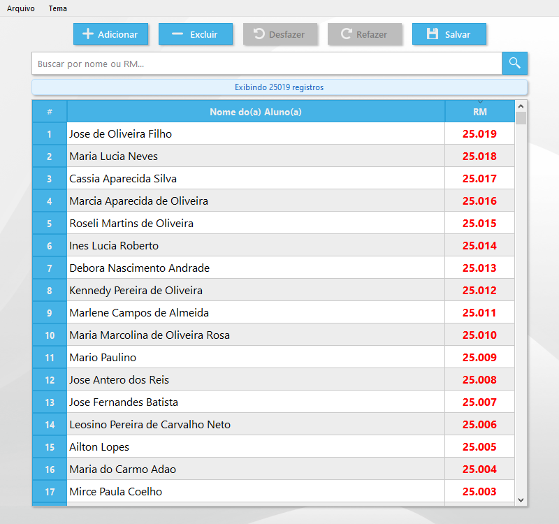

Um programa em Python projetado para facilitar a organização e busca de Registro de Matrícula (RM) de alunos e ex-alunos, carregando arquivos Excel e permitindo pesquisa, adição e atualização de registros de forma prática e eficiente. Ideal para escolas que utilizam sistemas de arquivamento físico de documentos e precisam modernizar o processo sem perder a essência do método original.

Obs.: Os nomes exibidos nos screenshots deste projeto são **fictícios** e foram gerados automaticamente por um script. Qualquer semelhança com nomes reais é mera coincidência.
